# 2.2 主线

主线承载了主要生物群系生成任务。

## 第一阶段

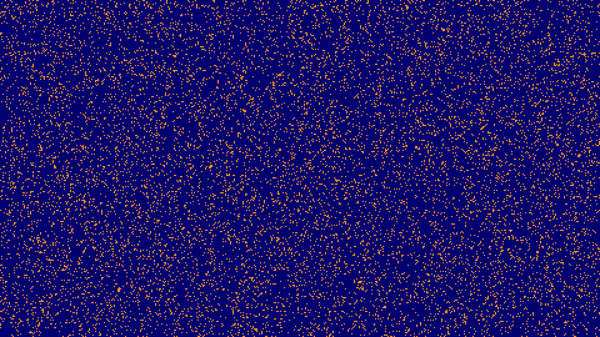

### 原始层

主线的第一阶段并非用实际上的生物群系来标记区域的，而是用 1、2、3、4 来表示大陆区域的温度，海洋、深海和蘑菇岛仍然使用生物群系 id 表示（混合表示法）。

主线的原始层 90% 被海洋覆盖，剩下 10% 是炎热大陆，是随机分布的。特别地，区域`0, 0`一定是炎热大陆。这就是你为什么有时候会出生在小岛上面，但是基本上不会直接被扔水里。

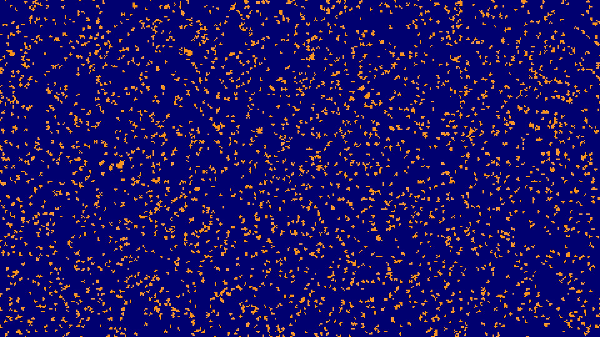

锯齿放大化，这是唯一一次又是使用锯齿放大化，而不是普通的放大化。

### 放大化

**放大化（Zoom）**将原本占有一个区域的生物群系扩散到 2 x 2 的四个区域。注意这个放大化和**放大化**世界类型没有关系，反倒是和**巨型生物群系**世界类型有关系，后面会提到。有的时候翻译总是那么捉弄人，就像上文提到的区域一样，不是吗？


如图所示（m ≥ 0, n ≥ 0，负半轴与此图水平、垂直镜像），方格外的坐标表示的是放大化之后的区域坐标，方格里面标有坐标的表示的是放大化之前对应的区域坐标，表示与原该坐标对应生物群系一致。接下来游戏会分别生成 A、B、C 三个区域的生物群系。我们不妨把`n, m`、`n, m + 1`、`n + 1, m`、`n + 1, m + 1`的生物群系分别记为 a、b、c、d。A 的生物群系即在 a 和 b 中随机选择一个，B的生物群系即在 a 和 c 的生物群系中随机选择一个。对于 C 的处理，两种放大化各有不同。如果是锯齿放大化，则直接随机选择四个其中的一个。如果是普通的放大化，则按照少数服从多数的原则进行挑选，具体规则如下：

* 如果存在三个相同的（如 a = b = c），那么就选择这一种（a）。
* 否则如果存在两个相同的，且另外两个各自不同（如 a = b 且 c ≠ d），那么就选择这一种（a）。
* 否则就不存在“多数”了，所以只能直接随机选择四个其中的一个。

\[TODO：动态放大化\]

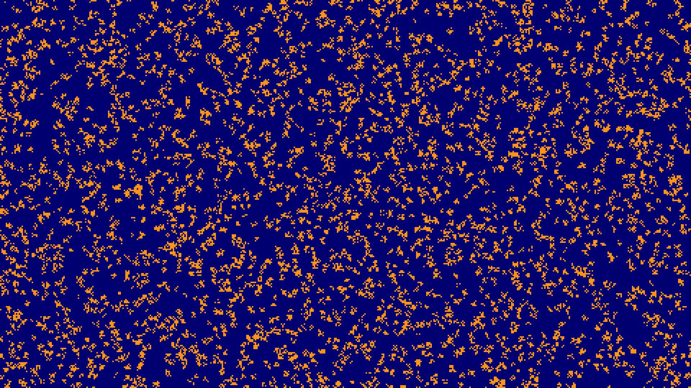

### 扩张

实际上扩张不总是陆地在扩张，如果有有兴趣的朋友可以去细致对比一下：有的时候是海洋扩张了。不过总体来看陆地扩张较多。

这种层在第二阶段也被使用，与第一阶段的混合表示法不同，第二阶段的幻数直接表示生物群系。在 MC 中，炎热和平原的幻数均为 1，而寒冷和森林的幻数均为 4。为了表述方便，下文用_热原_和_冷森_来表示幻数 1 和 4。

* 如果自己不是海，四周（象）其中一个是海，那自己就会变成海（除非自己是_冷森_，就还是_冷森_）。
* 否则如果四周（象）也是海，那自己就还是海。
* 否则变为_热原_，有一定概率变为四周（象）的生物群系。

最后这一分支计算比较复杂，不便于口述，干脆直接代码奉上（其中`context.nextInt(n)`生成一个位于`[0, n)`的随机噪声）。

```java
int i = 1;
int ret = HOT_OR_PLAINS;
if (!isShallowOcean(northeast) && context.nextInt(i++) == 0) ret = northeast;
if (!isShallowOcean(northwest) && context.nextInt(i++) == 0) ret = northwest;
if (!isShallowOcean(southwest) && context.nextInt(i++) == 0) ret = southwest;
if (!isShallowOcean(southeast) && context.nextInt(i++) == 0) ret = southeast;

return context.nextInt(3) == 0 ? ret : ret == COLD_OR_FOREST ? COLD_OR_FOREST : center;
```

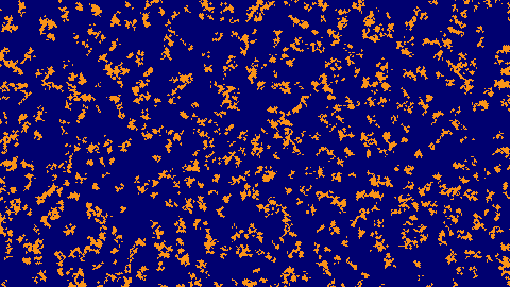

放大化。

 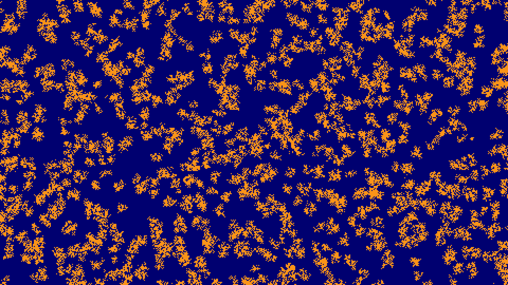 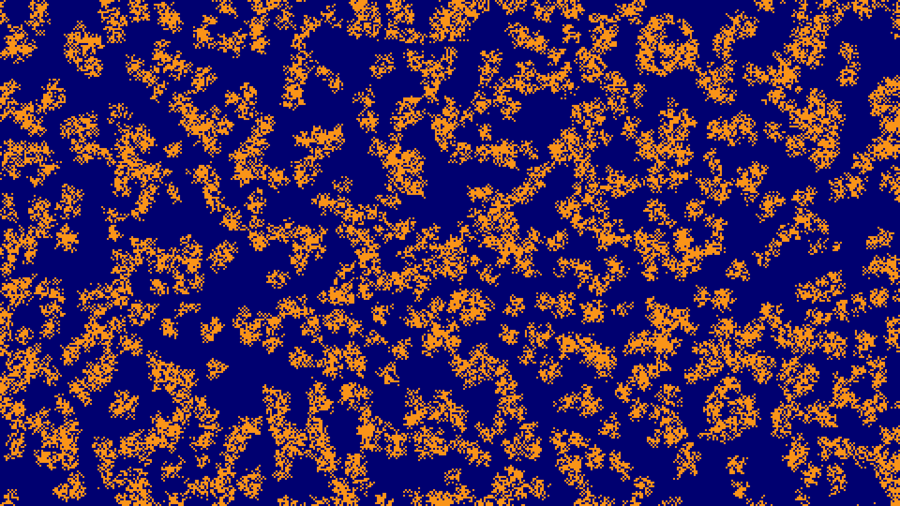

三次扩张。如果看过 1.6 生物群系图的朋友应该能看出这其实就是整个世界的雏形了。从图可看出，所有海洋都是联通的，海洋总面积过半。

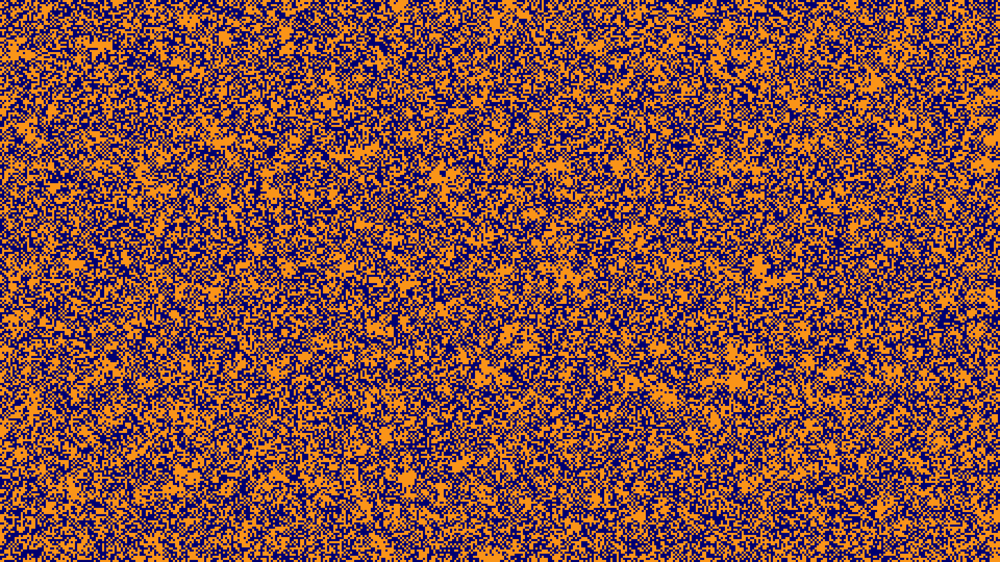

### 抽干海洋

这一层_可以认为_是在 1.7 加入的。不难看出，前面扩大陆地这么多次，不如这一次来的效率高。图可看出，与之前恰恰相反：几乎所有陆地都是联通的，陆地总面积过半

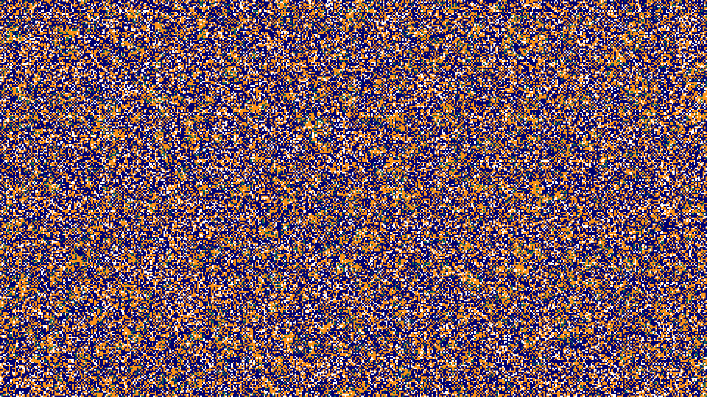

### 降温

将原本有的炎热大陆群系变为冰冷和凉爽，各有 1/6 的概率。剩下的 2/3 陆地还是炎热。

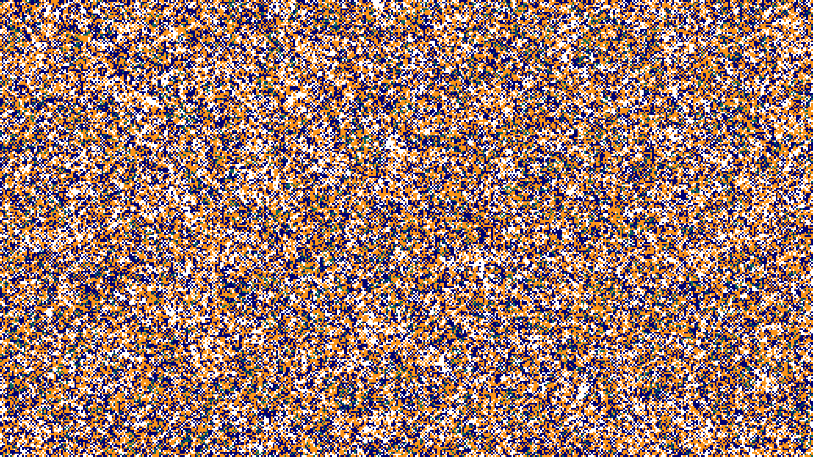

扩张

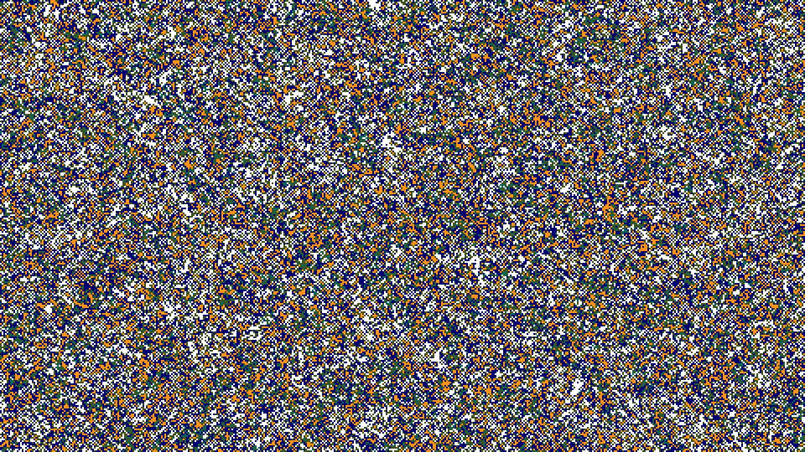

转化：凉爽化。

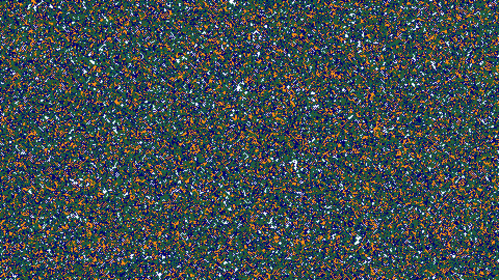

转化：温暖化。


转化：稀有化。

### 转化

这个名字非常平庸，我胡乱起的。主要原因是第三个和前两个几乎毫无联系。

凉爽化：如果自己是炎热，且周围（車）是凉爽或寒冷，就变成温暖。

温暖化：如果自己是寒冷，且周围（車）是炎热或温暖，就变成凉爽。

稀有化：如果自己不是海，就有 1/13 的几率进行不可描述之事：

```java
value |= 1 + context.nextInt(15) << 8 & 0xF00;
```

其中 value 就是这个区域的生物群系 id。注意运算符优先级哦。可以看出，这个数字的高位被标记了一下。后面这个标记的数字会派上用场。我用另一种颜色的像素来表示这样的区域。

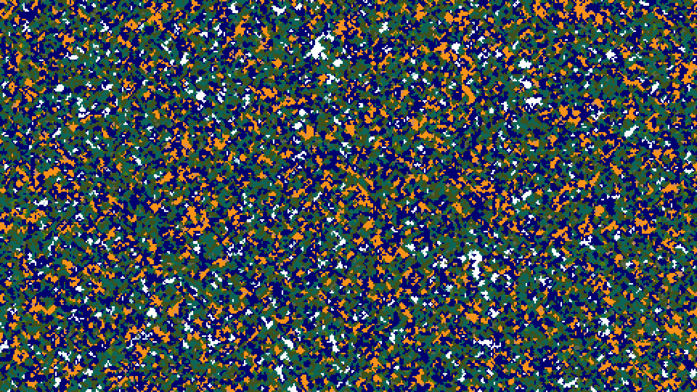 

两次放大化


扩张


### 蘑菇岛

把 1% 的四周（象）也是海洋的海洋区域变为蘑菇岛区域。


### 加入深海

将四周（車）也是海洋的海洋区域变为深海区域。

河流支线：[水源](2.3-he-liu-zhi-xian.md#水源)

## 第二阶段

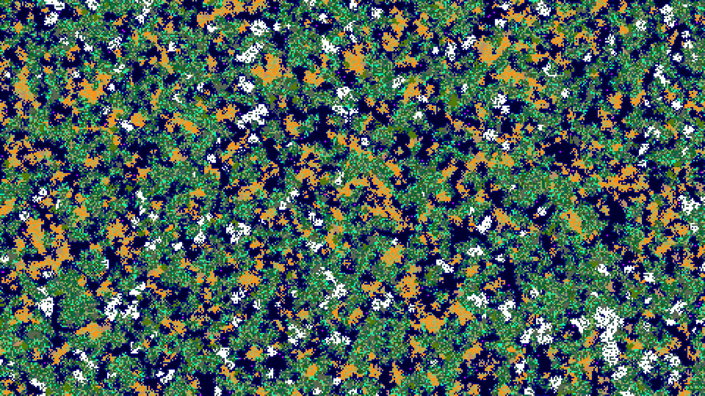

### 生物群系层

**生物群系层（BiomeLayer）**是最为关键的一层之一。这一次实际上选择了具体的生物群系。前面的海洋、深海、蘑菇岛不变，其余区域按下列规则选择生物群系：

* 先选择行：如果之前区域的低位不属于下表第一列中任何一个，即为蘑菇岛。
* 除寒冷之外，若之前区域高位有（转化：稀有化中提到的）数字，则取稀有列，否则取普通列。寒冷只有普通列。
* 行和列都确定了，选中格子后随机选择格子中的一个生物群系，后面的数字表示权重。没有数字默认为 1

| 之前区域 | 普通 | 稀有 |
| :--- | :--- | :--- |
| 炎热 | 沙漠（3） 热带草原（2） 平原 | 恶地高原 繁茂的恶地高原（2） |
| 温暖 | 森林、黑森林、山地 平原、桦木森林、沼泽 | 丛林 |
| 凉爽 | 森林、山地、针叶林、平原 | 巨型针叶林 |
| 寒冷 | 积雪的冻原（3） 积雪的针叶林 | - |

如果前面的区域图只是一块干巴巴的面包片，这一层浇上去的便是五彩的酱汁。


### 竹林

把 10% 的丛林变成竹林

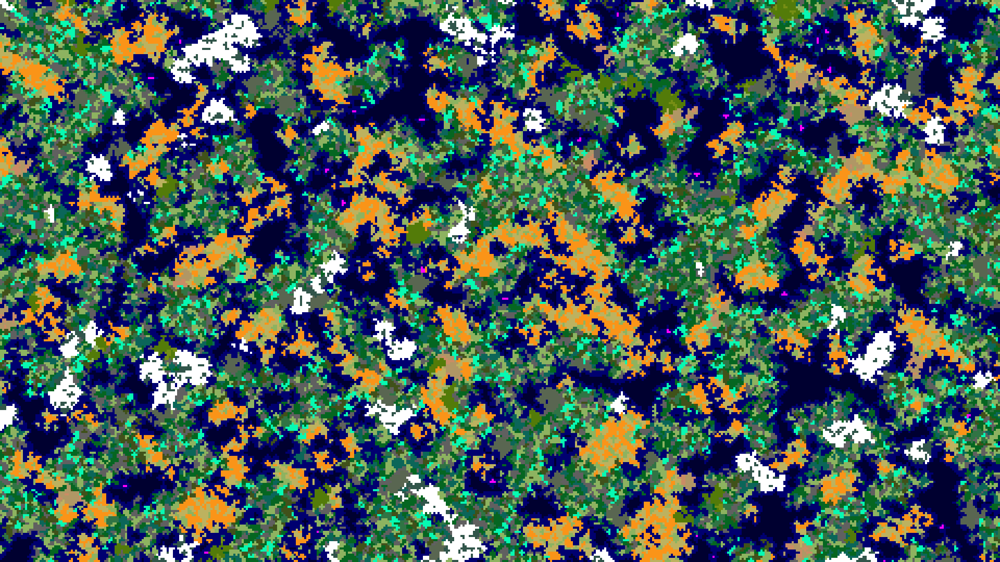 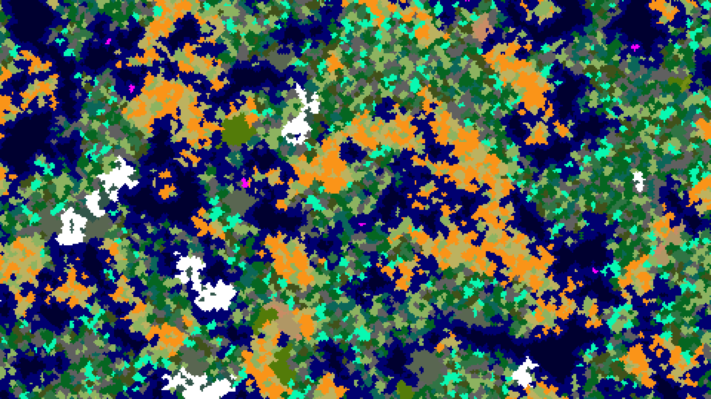

两次放大化


加入边缘


加入丘陵

**边缘（Edge）**、**丘陵（Hills）**、**海滩（Shore）**是 MC 插入在两种不同生物群系中间用于过渡的生物群系，海滩会在后文中提到，下面讲解的是边缘和丘陵。

### 相似生物群系

TODO

### 边缘

TODO

### 丘陵

丘陵层一个二元层，一个参数是主线层，另一个是河流层。主线层的生物群系记为`a`。前文提到，河流层生成的是`[0+2, 299999+2)`之间的一个随机噪声，而丘陵层使用的数据是该层减 2，即`[0, 299999)`，并对 29 取模记为`r`。

第一次尝试成功的条件是：如果`a`不是浅海且不是变种生物群系，同时`r`为 1 。

如果成功：

* 如果`a`有变种就变为`a`的变种
* 如果`a`没有变种就保持`a`不变

如果失败，则进入第二次尝试：

* 当`r`不为 0 时，就有 1 / 3 的概率进入第二次尝试，并根据`a`选择对应的丘陵生物群系记为`h`。如果没有对应的`h`，这次尝试也会失败。把`h`记为`ret`。
* 当`r`为 0 时，直接进入第二次尝试，并根据`a`选择对应的丘陵生物群系及其变种记为`h`和`mh`。如果没有对应的`h`，或者`h`没有变种，这次尝试也会失败。把`mh`记为`ret`。

如果四周（車）至少有 3 个区域的生物群系相似于`a`，尝试成功，该区域变为`ret`。如果上述尝试都失败，就保持`a`不变。

下表是经过我整理后得出，在这里可能出现的原生物群系与对应丘陵生物群系的对照表。和上文相同，括号里的数字代表权值，没有数字默认为 1。

| 原生物群系 | 丘陵生物群系 |
| :--- | :--- |
| 沙漠 | 沙漠丘陵 |
| 森林 | 繁茂丘陵 |
| 桦木森林 | 桦木森林丘陵 |
| 黑森林 | 平原 |
| 针叶林 | 针叶林丘陵 |
| 巨型针叶林 | 巨型针叶林丘陵 |
| 积雪的针叶林 | 积雪的针叶林丘陵 |
| 平原 | 繁茂山地、森林（2） |
| 积雪的冻原 | 积雪的冻原丘陵 |
| 丛林 | 丛林丘陵 |
| 竹林 | 竹林丘陵 |
| 海洋 | 深海 |
| 山地 | 繁茂山地 |
| 热带草原 | 热带高原 |
| 类别为恶地 | 恶地 |
| 1 / 3 的深海 | 平原、森林 |

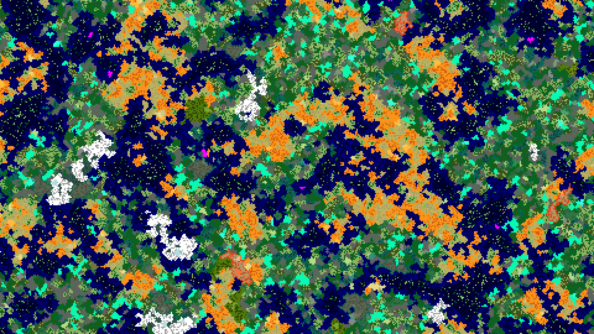

### 向日葵平原

把 1/57 的平原变为向日葵平原

[支链链接](2.3-he-liu-zhi-xian.md#河流距离)

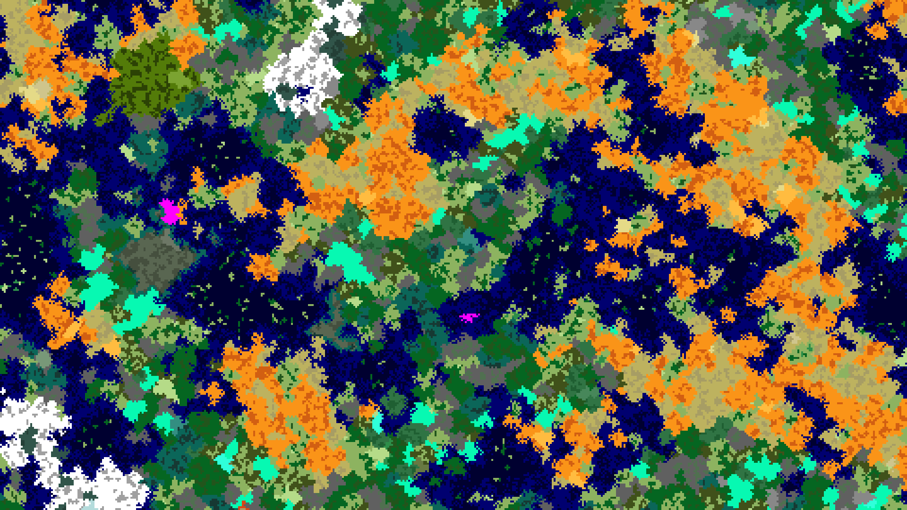   

### 生物群系大小

上图连续放大了四次，其中前两次还夹带了私活，这一阶段实际上是根据世界生成的一个重要参数——**生物群系大小（BiomeSize）**进行的。原版的**默认（Default）**世界类型这个数字是 4，而**巨型生物生物群系（LargeBiomes）**世界类型这个数字是6。根据前面对放大化的解释可以知道，巨型生物群系的生物群系的面积将会是默认的 16 倍，即 x 和 z 方向各 4 倍。

在第一次放大化完成之后，将会再进行最后一次扩张。详解见上文扩张一节。

在第二次放大化完成之后（如果生物群系大小仅为 1，则在扩张完成后），添加海滩生物群系。

### 海滩

生成海滩的前提是自己不是海、不是沼泽。原则是：现在第一列找到自己的类别，判断周围的条件，如果失败就不再尝试、维持现状。唯一的例外是丛林有两次机会。

| 自己 | 周围（車） | 海岸 |
| :--- | :--- | :--- |
| 蘑菇岛 | 任意一个是浅海 | 蘑菇岛海岸 |
| 类别为丛林 | 任意一个不兼容丛林1 | 丛林边缘 |
| 类别为丛林 | 任意一个是海洋 | 沙滩 |
| 山地或繁茂山地 | 任意一个是海洋 | 石滩 |
| 降水类型为雪 | 任意一个是海洋 | 积雪的沙滩 |
| 恶地或 繁茂的恶地高原 | 任意一个类别不是恶地 且全都不是海洋 | 沙漠 |
| 其它 | 任意一个是海洋 | 沙滩 |

1兼容丛林的生物群系有：类别为丛林的生物群系、森林、针叶林、海洋


### 平滑

平滑层会根据四周（車）的生物群系改变自己的生物群系，规则如下：

* 若东等于西且南等于北，则随机选择西或北
* 若仅东等于西，则选择西
* 若仅南等于北，则选择北
* 上述尝试都失败，维持现状。


### 混合河流

[支线链接](2.3-he-liu-zhi-xian.md#合并河流)

如果主线是海洋，或河流支线不是河流（7），就维持原状，否则根据下表选择一个河流。

| 原生物群系 | 河流生物群系 |
| :--- | :--- |
| 积雪的冻原 | 冻河 |
| 蘑菇岛或蘑菇岛海滩 | 蘑菇岛海滩 |
| 其他 | 河流 |


### 混合海洋

[支线链接](2.4-hai-yang-zhi-xian.md#海洋支线)

创建、合并了海洋支线，使主线层的海水有了温度。可惜这幅图中无法体现，因为刚好没出现其他温度的海洋。

混合规则：如果周围 16 x 16 的区域有非海洋区域，暖水海洋变为温水，冻洋变为冷水海洋。否则，如果主线层是深海，还会对海洋支线层传来的浅海转变为对应的**深海**生物群系。注意：暖水海洋**不会**进行这样的转换。

至此，所有层的工作都完成了。所得的便是每一个区域的生物群系。这些生物群系会被缓存到每个区块中，稍后会提到这样的缓存。

## 完成：动态放大化


TODO

