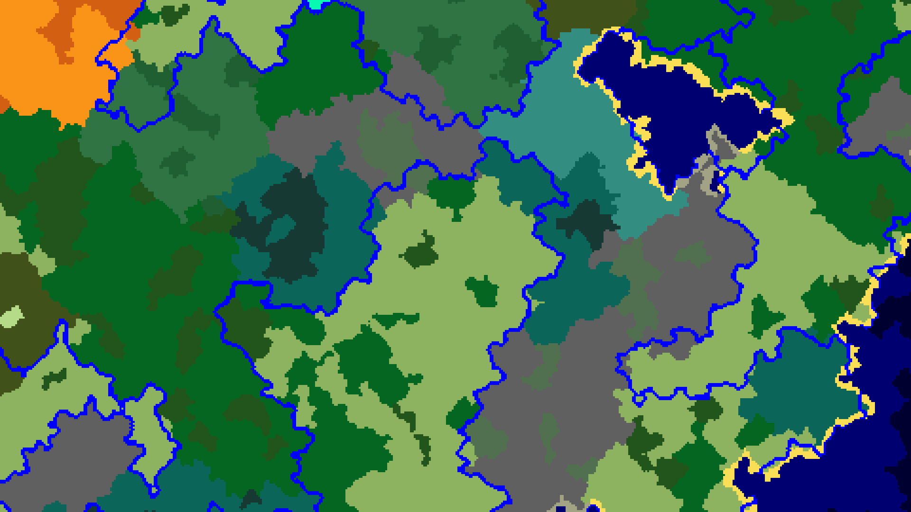

# 2.4 海洋支线

[主线链接](2.2-zhu-xian.md#混合海洋)

海洋支线的第一层，利用噪声算法，生成不同温度的**浅海**。

     

紧接着：六次放大化

非常有趣的一点：这里的放大化次数不会因为 biomeSize 的改变而改变，导致巨型生物群系世界类型下的河流和默认世界类型下的河流大小、位置几乎无差，所以看上去不像默认世界类型那样契合生物群系边界。

紧接着：最后海洋支线被合并

