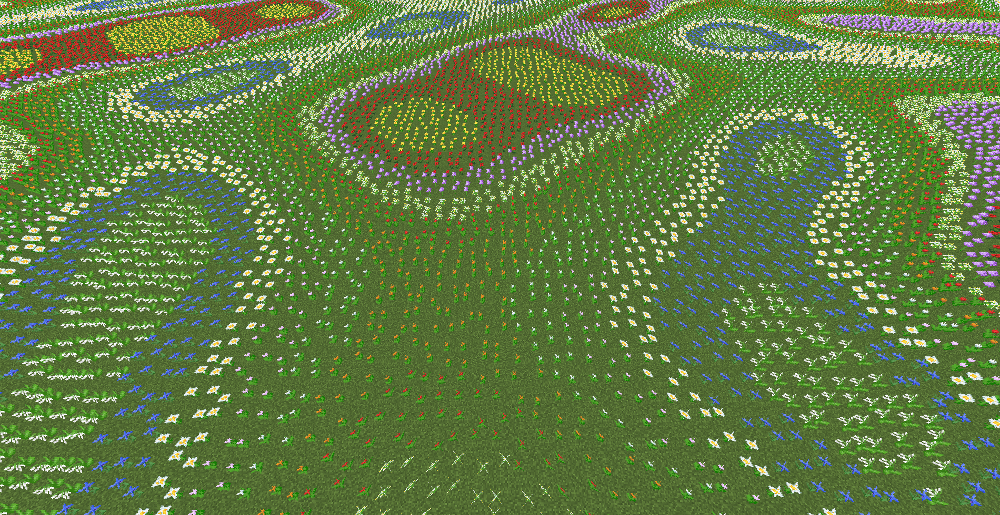

# 生物群系属性

生物群系之所以不同，是因为他们有不同的**生物群系属性**。生物群系属性是表征生物群系特性的数据。

生物群系的属性主要有两个方面的作用：

- 提供直观的视觉体验、听觉体验等。——客户端
- 提供生物群系生成、世界逻辑运转的依据等。——服务端

而这些属性，大部分都可以在自定义生物群系时指定。

原版生物群系属性的具体值，详见本文[附录](../appendices/tables-of-data.md)。

-----

下面我们概述生物群系的所有属性，并详细介绍一些重要的属性。

## 类别

**类别（Category）** 描述的是某一类生物群系所拥有的共同特征。例如，当我说“恶地”的时候，浮现在你脑海里的，绝对不止一个生物群系；那具体有几个恶地、分别叫什么呢？可能就会难倒不少人了。但有一点毫无疑问：反正它跟恶地是一类嘛，这也就是类别的意义。

类别在许多领域都有应用，这里没法一一举例了。而它在生物群系生成中扮演的重要的角色，将在主世界生成中的**相似生物群系**中大显光彩。

## 气候

**气候（Climate）** 是生物群系贯穿始终的最重要的属性，是对生物群系特征的直观感受的概括。粗略分为温度和降水量两个部分。

### 温度、温度修饰符

**温度（Temperature）** 这一属性代表了这个生物群系的**默认温度**。默认温度常常参与的是未知空间上下文的情况的计算。而具体到每个方块上的温度，这里不妨叫**当地温度**。当地温度是默认温度先经过**温度修饰符（TemperatureModifier）** 进行修饰，再根据高度调整得到。

| 温度修饰符 | 生物群系 | 特点 |
| :--- | :--- | :--- |
| none | 其它生物群系 | 直接返回默认温度 |
| frozen | 冻洋、封冻深海 | 根据噪声进行修饰 |

相比而言，高度占主导因素：在 y &gt; 64 后，当地温度会逐渐减小。

### 降水量和降水类型

**降水量（Downfall）** 代表了这个生物群系的具体湿度。主要用于决定草的颜色，此外降水量大于 0.85 的生物群系的对火的蔓延有抑制作用。而与降水量定量不同，**降水类型（Precipitation）** 更多的是定性。

以上属性造成影响如下表所示：

| 当地温度 | 降水类型 | 影响 |
| :---: | :---: | :---: |
| - | snow | 雪地兔兔~ |
| 大于等于 0.15 | rain | 判定为下雨 |
| 大于等于 0.15 | - | 不会有雪、不会有冰 |
| 小于 0.8 | - | 雪人走过的地方会产生雪片 |
| 大于 1 | - | 雪人受伤 |

此外，温度和降水量还会参与到植物颜色的渲染等。

## 地形

**地形** 是生物群系生成中的重要特征，与地形的噪声密切相关。

**深度（Depth）** 描述的是生物群系的平均海拔。注意这是一个平均值，比如若该数值为 0，虽说理论上是和海平面齐平，但其实相当低洼，因为真正的高度会根据噪声和规模有所起伏。

**规模（Scale）** 描述的是生物群系的高度差值。这个数值越大，地形的高低起伏越大。**放大化（Amplified）** 世界类型、**旧版自定义（Customize）** 世界类型的“山脉狂魔”预设就是扩大了这个数值。放大化在此之外还做了一些特殊处理。

如果说最初的噪声是随机变量 $X$ ，深度是 $a$，规模是 $b$，那么最后地形高度的随机变量 $Y$ 即为：
$$
Y=bX+a
$$

## 世界生成设置

**世界生成设置（GenerationSettings）** 包含了一些与世界生成有关（主要是地形和特性方面）的内容，包含

* **地表构造器（SurfaceBuilder）** 地表的大的风貌构造，例如恶地的风貌就比较特殊。
* **镂空器（Carver）** 凿空方块，添加空气或者流体。
* **特性（Feature）** 花草树木，矿石矿井等都是特性。
  * **结构（Structure）** 特别的，如村庄、要塞、废弃矿井等都属于结构。
  * **花（Flower）** 一格高的，可自然生成的花。

### 花

> （双手托起头）我是一朵花
>
> ——Yaossg 早年迷惑行为

**花（Flower）** 种类繁多，极大的美化了 MC 的自然景观。在生物群系属性的世界生成设置中单独列出的，是一格高的，可自然生成的花。

花有两种途径获得，一种是世界生成时自带的花，另一种是使用骨粉对草方块右键得到的草丛中会有少许的花。这两种途径获得的花是一致的。

在绝大多数生物群系中，都只会生成虞美人和蒲公英（两者生成的权重为2：1），而沼泽只会生成兰花。蘑菇岛和恶地不生成花。

但是在一些特殊的生物群系中，如（普通或者向日葵）平原、繁华森林中，会根据生成坐标的当地噪声，由**方块状态提供器（BlockStateProvider）** 从可选的方块状态中选择一些花进行放置。由于与当地噪声直接相关，这样生成出来的花，即使在随机之中也存在一些规律。这种规律在离散的花丛之间无法观察到，我们不妨来看看如果整个屏幕都被花铺满会是什么样子。

#### 平原花

平原花主要分为两类——郁金香和非郁金香。

只有在当噪声低于阈值时，即为郁金香，每种颜色的郁金香的概率是相等的。可以发现，这样就构成了一片片郁金香区域。只有区域之内才可以是郁金香。

其它地方生成花朵种类和对应的权重如下表所示：

| 花     | 权重 |
| ------ | ---- |
| 蒲公英 | 2    |
| 虞美人 | 1    |
| 茜草花 | 1    |
| 滨菊   | 1    |
| 矢车菊 | 1    |

实际上，对历史略知一二就不难注意到，后四种花（除了后来加入的矢车菊）从前使用的是同一个数据值，姑且叫做“虞美人系”，无论是前面提到的“绝大多数生物群系”，还是繁华森林，“虞美人系”与蒲公英生成权重的比值都是2：1。只不过在繁华森林中虞美人有了更多“变种”罢了。

#### 森林花

如果说平原花还带点随机的影子，森林花属于是直接不演了——只要生物群系是繁华森林，确定位置的花是确定的。由于是由噪声决定的，所以可以非常明显的看出条带状的边界，和他们共同形成的“阶梯”。这其实给我们一点启示，我们可以根据我们对不同颜色染料的需求，选择在特定的区域刷花。

噪声从低到高，它们分别是：

- 蒲公英
- 虞美人
- 绒球葱
- 茜草花
- 红色郁金香
- 橙色郁金香
- 白色郁金香
- 粉红色郁金香
- 滨菊
- 矢车菊
- 铃兰

_其实我后来根本不想写这一小节了，完全是依仗不舍得丢两幅图给的动力，真可谓是为了这碟醋才包的饺子。_

## 生物生成设置

**生物生成设置（SpawnSettings）**

* 生物生成概率：数值越高，自然生成的动物就越多。寒冷地区这个值偏低。
* 候选生成生物和生成密度。（在主世界的体验并不明显，但下界的区别是非常明显的）
* 是否适于玩家出生。（玩家会尽可能优先在这些生物群系中出生）

## 气氛

生物群系**特效（Effects）**，主要带来视听体验，营造**气氛（Ambience）**。

* 雾的颜色
* 水的颜色
* 水中雾的颜色
* 天空颜色
* 树叶颜色
* 草颜色
* 草颜色修饰符
* 粒子效果
* 循环音效
* 环境音效
* 额外音效
* 音乐

并非所有生物群系都有上述特效。