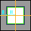
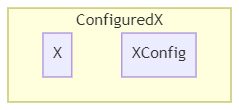

# 区块

> I used to rule the world 我曾统治这世界
>
> **Chunks** would load when I gave the word ~~**区块**会在我的命令下加载~~ 世界听我号令运转
>
> ——CaptainSparklez《Fallen Kingdom》

**区块（Chunk）** 作为一个符号，不得不承认，虽然并不总是如此，但它的的确确成为了世界生成乃至世界的象征。无论是否与世界生成有关，在各种场合，区块这个概念总是被经常提及——好像世界就应该这么分一样。确实，世界生成确实也应该从它讲起。

## 区块生成器

**区块生成器（ChunkGenerator）**，是之前已经提到的，两大非常重要的世界生成提供者之一。

区块生成器分为三种：**噪声**区块生成器（**Noise**ChunkGenerator）、**平坦**区块生成器（**Flat**ChunkGenerator）、**调试**区块生成器（**Debug**ChunkGenerator）。在这里，我们主要介绍噪声区块生成器。另外两个区块生成器参见第三章。

噪声区块生成器主要负责（不分先后）：

- 要塞的选址
- 生物群系的选择
- 应用镂空器
- 特性（包括结构和花）的放置
- 地表和基岩的放置
- 生成原生生物（伴随世界生成产生的生物）

期间与生物群系来源的合作十分紧密。

### 区块状态

这些功能在区块生成的不同状态时被调用，前作已经有过介绍。1.16 中这些状态被细化成了下面 13 个状态：

| 状态                 | 颜色     | 高度图类别 | 范围 | 等级  |
| -------------------- | -------- | ---------- | ---- | ----- |
| empty                | 5526612  | 甲类       | -1   | 44+   |
| structure_starts     | 10066329 | 甲类       | 0    | 36-43 |
| structure_references | 6250897  | 甲类       | 8    |       |
| biomes               | 8434258  | 甲类       | 0    |       |
| noise                | 13750737 | 甲类       | 8    |       |
| surface              | 7497737  | 甲类       | 0    |       |
| carvers              | 7169628  | 甲类       | 0    |       |
| liquid_carvers       | 3159410  | 乙类       | 0    | 35    |
| features             | 2213376  | 乙类       | 8    | 34    |
| light                | 13421772 | 乙类       | 1    |       |
| spawn                | 15884384 | 乙类       | 0    |       |
| heightmaps           | 15658734 | 乙类       | 0    |       |
| full                 | 16777215 | 乙类       | 0    | 33-   |

区块状态仍然分为两类，只有最后一个状态是**存档区级（Level Chunk）** 用于正常的游戏逻辑，而前面的状态都是**原型区块（Proto Chunk）** 专用于世界生成。

高度图类型分为两种，决定了出于当前状态下需要更新的高度图有哪些。可以看出，甲类的均为世界生成专用的高度图，乙类均为正常游戏逻辑使用的高度图。

| 高度图类别 | 高度图                                                       |
| ---------- | ------------------------------------------------------------ |
| 甲类       | OCEAN_FLOOR_WG, WORLD_SURFACE_WG                             |
| 乙类       | OCEAN_FLOOR, WORLD_SURFACE, MOTION_BLOCKING, MOTION_BLOCKING_NO_LEAVES |

### 区块加载与世界生成

上表中的范围（Range）决定的是，某区块进入该状态时，需要加载的周围区块的曼哈顿半径 `r`（该半径下构成的正方形区域边长是 `2 * r + 1`）。-1 无意义。

那么所加载的区块至少需要到那个状态呢？这与区块的等级（Level）有关。我们可以从世界生成加载界面中的图案中得到一些启示。在世界生成加载界面中，每一个生物群系状态对应一种颜色。图片正中心像素的 level = 22，向外每延伸一格，level 加一。颜色和等级对应的区块状态见上表。

（图中的橙色青色为助于识别的辅助线、辅助点和长度标记，实际界面中并不存在）

这张图并非总是那么规整，实际上，当出现结构需要加载的时候，level 会被故意提高，保证结构的完整的加载。

触发区块 level 改变的不仅仅只有创建世界。实际上，Mojang 引入了**票（Ticket）** 的概念来管理区块加载。欲知更多相关内容，可以转阅海螺的文章（链接见附录）

------

### Configuration 设计模式

无论是特性、放置器，还是镂空器、地表构造器（`X = Feature, Placement, Carver, SurfaceBuilder`），都存在 `X ~ XConfig` 的设计模式，即 `X` 提供逻辑，`XConfig` （译作 X 的配置）提供逻辑需要的参数。把 `X ~ XConfig` 绑定在一起的类被称为 `ConfiguredX`（译作 已配置的 X）。其结构如下图所示。

接下来不分先后的介绍这四个在区块和生物群系生成中的特点和作用。

### 镂空器

**镂空器（Carver）**，又译作雕刻器，是用来为世界打洞的。这也是为什么我把它译作镂空器的原因。以打洞结束之后填充物的不同，可以分为空气镂空和液体镂空两类。主世界的普通和水下洞穴和峡谷，下界的洞穴，都是它完成的。

### 特性放置

**特性（Feature）**，又译作地物，是世界生成的基本元素。特性的装饰（Decorate）遵守一个基本的次序，如下表所示。

| 英文                   | 翻译     | 内容                         |
| ---------------------- | -------- | ---------------------------- |
| RAW_GENERATION         | 原生生成 | 末地小岛                     |
| LAKES                  | 湖       | 湖和岩浆湖                   |
| LOCAL_MODIFICATIONS    | 本地修饰 | 地面苔石、冰山、玄武岩柱     |
| UNDERGROUND_STRUCTURES | 地下结构 | 略                           |
| SURFACE_STRUCTURES     | 地面结构 | 略                           |
| STRONGHOLDS            | 要塞     | 要塞                         |
| UNDERGROUND_ORES       | 地下矿石 | 主世界的矿物                 |
| UNDERGROUND_DECORATION | 地下装饰 | _主要为_ 下界的矿物          |
| VEGETAL_DECORATION     | 植物装饰 | 花草树瓜藤竹菌               |
| TOP_LAYER_MODIFICATION | 顶层修饰 | 海面的冰，虚空平台，超平坦层 |

虚空平台和超平坦层与超平坦有关，参见 [3.1 节](../3-the-otherworlds/3.1-fixed.md#超平坦)。

特性的放置还与**放置器（Placement）** 有关。特性只决定特性本身的形状，而放置器决定放置次数或概率和位置的选择。每一层放置器都会套上一层特性，以便于下一个放置器使用。最后包装好的特性会被分门别类存在生物群系对应的装饰阶段的列表里。一般而言，最终包装好的特性如下图所示。

### 地表与基岩构造

**地表构造器（SurfaceBuilder）** 是营造地面景观最直接的工具。不同于特性的特定而离散，地表构造器的工作广泛而连续。须知，世界原本只有贫瘠的石头水和空气，最经典的地表——一层草块三层土——便是这个时候建造的。

过去基岩的添加也是这个阶段所为。但是这其实是比较荒诞的，也就是，如果你覆盖了地表构造，就必须兼顾基岩生成。更加让人感到啼笑皆非的是，基岩生成是从 255 格开始向下判定 😅！现在基岩生成独立出来了，也不会从那么高就开始判断生成基岩了。

-----

### 原生生物生成

原生生物指的是世界生成之后就已经在世界中的生物。原生生物的生成次数 $X$ 符合几何分布，即 $X\sim G(1-p)$。其中 $p$ 是生物群系生物生成信息中的生物生成概率。每次生成会根据权重随机在候选列表中选一个进行生成。

## 区段

**区段（Section）** 是区块沿 y 轴切割得到的 16 等分之一。区段是区块文件中存储方块状态、亮度的最小单位。这里我们主要介绍方块的储存。

**调色盘（Palette）** 是方块状态储存中用到的一种压缩方式。如何理解调色盘呢，我们可以从字面意思来类比说明。

对于一幅不透明的像素画，我们当然可以选择用一个二维数组来储存每个像素的颜色值。以 RGB 为例，这需要至少 24 bits 才能储存一个像素。对于一幅稍大点的画作，这样的储存方式将会大的惊人（例如一幅 1920 x 1080 的高清图片，至少需要 47 MB 的空间）。

类似的，我们也可以用一个三维数组来存每个位置的方块状态，但是储存一个方块所需要的空间可远远不止 24 bits。移除方块的数字 id 之后，需要使用完整的名字（例如`"minecraft:stone"`）和表示状态的字符串到字符串的哈希表（例如`{"facing": "north", "waterlogged": "false"}`）来表示一个方块状态，这样的话表示一个方块状态所需的内存将非常的大！更别提世界中不可胜数的方块！

如何压缩呢？不难想到一幅画里的不少像素的颜色其实是一样的，既然如此，我们可以设立一个调色盘，用给图片里所有使用的颜色编号，然后在二维数组中使用这个编号来代替这个颜色。储存编号所需要的空间取决于这幅画有多少种颜色，而这几乎肯定是少于 24 bits 的（例如一幅 1920 x 1080 的高清图片，里面用了 60 种颜色，那么储存一个编号就需要 6 bits，加上一个字典，大约需要 12 MB 的空间）。

类似的，在储存方块的时候，我们也可以这么做。用一个调色盘，或者说字典，给所有区段里的方块编号，然后在三维数组中用这个编号来代替这个方块。实际上，换成整数之后，Mojang 采用了一种比三维数组更紧凑的方法来存储编号。因此，虽然压缩图片的效果不算明显，但是对于方块状态的情形就完全不一样了。这样的压缩算法可以高效使所需空间大大减少。

值得注意的是，在调色盘的例子里面，当颜色数量非常大（以至于非常接近 224）的时候，储存编号和储存颜色所需空间相仿，导致调色盘压缩失灵——你甚至额外还存了一个巨大的调色盘。但是对于区段来说，这几乎不会成为问题——调色盘所占用的额外空间，在储存方块所需空间面前几乎可以忽略不计。何况在一个小小的区段里塞下数千个不同的方块状态，这本身就非常困难。

空的区段（即，全是空气的区段）不会被储存，因此你不需要担心每个区块上空那些区段会不会占用很多空间，同时你也能够找到某些服务器会限高的部分原因了。

## 区元

然而，除了区块，其实还有很多有关世界生成的大小分块。Sebrarin 的说法并不严格，因为：**区元（Area）** 是 MC 生成生物群系的最小单位。

### 区元的来龙去脉

在 1.15 之前，每个区块的生物群系被储存在一个大小为 16 x 16 的数组里面，储存了区块内每一个 1 x 1 x 256 的生物群系。

1.15 更新之后，每个区块的生物群系被储存在一个大小为 4 x 4 x 64 的数组里面，数组里的每一个元素，代表的是一个区元里的生物群系，至于每个方块的生物群系，会动态地计算。

尽管加入了高度支持，但目前所有的生物群系来源生成得到的 x 和 z 相同而 y 不同的区元仍然总是包含相同的生物群系；真正高度上的差别是体现在最后打磨后的，方块尺度上的。不过希望还是要有，我们离 3D 生物群系的支持实际上只差一步之遥。在多重噪声生物群系来源代码中，有一个 boolean 值，直接决定是否让 y 参与计算。目前它_永远_为 false，不过我相信一定不会_永远_为 false 的。（补：这一点在 1.17、1.18 中应验）

在接下来的叙述中，本文用`(x: int, z: int)`这样的二元组来表示 x 和 z 相同的 16 个区元的坐标，其他（如方块、区块等）的坐标会另做说明。

------

### 区元命名杂谈

在最初翻译 Area 时，我不假思索的用了“区域”一词。这本来无可厚非，Area 最常见的翻译就是这个。然而当我意识到它与已有的一个概念——**区域（Region）**，撞车的时候，已经有一段时间了。为此，我当时不得不在文章里写到

> **注意：Region（32 x 32 区块）的翻译也是“区域”。本文无特别说明区域均指 Area，请勿混淆。**

后来觉得这样欠妥，决定还是换个名字。作为生物群系生成的最小单位，作为世界生成中用到的最小的方块集合，也就是最小的一个“区”的概念，“元”一字它当之无愧。

-----

不过此名字一出，便遭各路嘲讽——这分明就是“屈原”嘛。是这样的，对此屈原也很恼火。我最喜欢屈原的一句话是

> 路漫漫其修远兮，吾将上下而求索
>
> ——屈原《离骚》

被嘲讽的可不仅是名字：说实话，写这个教程，何尝不是一个“上下求索”的过程呢？

> 举目见日，不见长安
>
> ——晋明帝语，《世说新语》

梦想遥不可及，现实却触手可得，然而有时候现实的残酷反而把人推向梦想那一边。可梦是做不完的，无尽的梦终究会成为无谓的梦。有时候香肠是一位理想主义者，幻想着心中的长安。但有时候又是一位现实主义者，因为永远也到不了长安。香肠正陷于这无尽的矛盾之中。

香肠的梦是什么？_本节内容结束_
