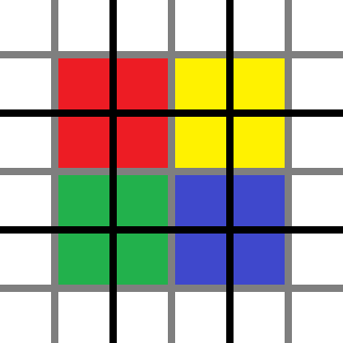

# 维度与生物群系

## 维度

原版有三个维度，他们是**主世界（Overworld）**、**下界（The Nether）**、**末地（The End）**。

**维度决定了世界生成**。三个维度，风格迥异，得益于他们提供的不同的**区块生成器**和**生物群系来源**。

[上一节](1.5-chunk.md)已经介绍了区块生成器和区元。下面介绍生物群系来源。

## 生物群系来源

**生物群系来源（BiomeSource）** 是**区元**生物群系的提供者。值得注意的是，1.16.5 的原版生物群系来源在生成生物群系的时候，不同 y 的区元的生物群系总是相同的。因此，在省略 y 的情况下，它的主要功能可以被描述为一个函数：

`BiomeSource: (x: int, z: int) -> Biome`

下表列出的是 1.16 所有的生物群系来源。

| 生物群系来源 | 中文 | 参数 | 特点 |
| :--- | :--- | :--- | :--- |
| checkerboard | 棋盘 | 生物群系池、规模 | 生物群系呈现棋盘状分布 |
| fixed | 固定 | 单个生物群系 | 全世界生物群系相同，用于超平坦、自选世界。 |
| vanilla\_layered | 原版层 | 生物群系池、种子、巨型生物群系 | 用于默认主世界的生物群系生成 |
| the\_end | 末地 | 生物群系池、种子 | 用于末地的生物群系生成 |
| multi\_noise | 多重噪声 | 生物群系（池、属性、参数）、种子 | 用于下界的生物群系生成 |

## 生物群系缓存

每个区元生物群系只生成一次。在生成之后，每个区元的生物群系将会被缓存在区块的一个数组中。一个区块有多少个区元，就有多少个整数。注意这里仍然使用整数，而不是生物群系名字，在 1.18 之后才终于采用了与方块类似的调色盘来储存。

这样的缓存可以避免生物群系不断地生成，节省了不少的时间。但同时，又不得不向空间妥协——这样的缓存单位是区元而不是方块。

## 生物群系访问

那么，同一个区元里的不同方块的生物群系是什么？从缓存到实际访问到的方块的生物群系，还有最后一步要走。

### 粗略访问

首先，粗略（Rough）地说，就是这个区元的生物群系嘛。毕竟就算有差，差的也不大。实际上，生物生成的时候参考的生物群系就是粗略的生物群系。

但是如果硬要精确到一个方块，粗略的后果就是边缘呈四格宽的锯齿状，太怪了。所以我们需要有所模糊。

### 模糊——实时放大化

为了利于讲解，这里我们考虑二维的情形。实际上模糊是三维上进行的。

如图所示，黑色线条是区元的边界，每个区元被灰色的线等分成四个部分。区元大小是 4 x 4 方块，那么每个部分实际上就是 2 x 2 方块。现在像图中这样上色，相同颜色的部分里的每个方块的生物群系是这个颜色所占据的四个区元中的其中一个的生物群系。离哪个区元的中心越近越可能是那个区元的生物群系。

这种模糊实际上是一次特殊的实时放大化。这次放大化，变的不是生物群系的尺寸，而是生物群系的精度，放大的不是两倍而是四倍，不是在世界生成时就算好，而是实时进行运算。有关放大化的内容，可以参见 [2.2 节](../2-the-overworld/2.2-main-layer.md#放大化) 的内容。

### 维度与模糊策略

不同维度的模糊策略不同，例如主世界在模糊的时候，会故意传入 y = 0，造成所有高度的生物群系都仿佛（as if）是 y = 0 上的生物群系。因此在主世界，不同高度的方块生物群系总是相同的。其他维度没有这样的处理，因此会存在高度不同的时候生物群系存在微小的差异。

正如前文所言，1.16.5 中，不同 y 的区元的生物群系总是相同的。因此下界和末地只能造两个生物群系的水平边缘上才能找到 y 不同时生物群系不同的情况，且这种情况并不是由 y 上区元生物群系的差异引起的（因为他们总是相同的）。但是需要申明：这样的模糊策略实际上是三维的。这也为 1.17+ 的更新做好了准备。

## 主世界与异界

在了解了本章的基本知识之后，我们可以深入分析 MC 的生物群系生成了。

接下来的两章里，我们会分别分析主世界和异界的生物群系生成。从不同维度观察维度的生存。
