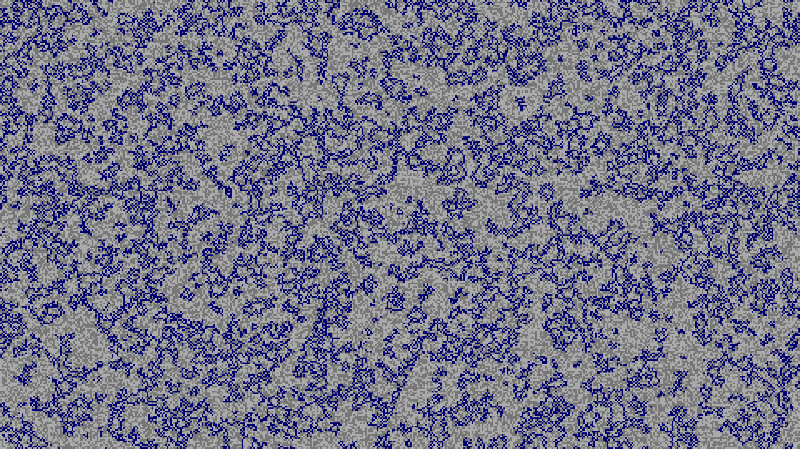
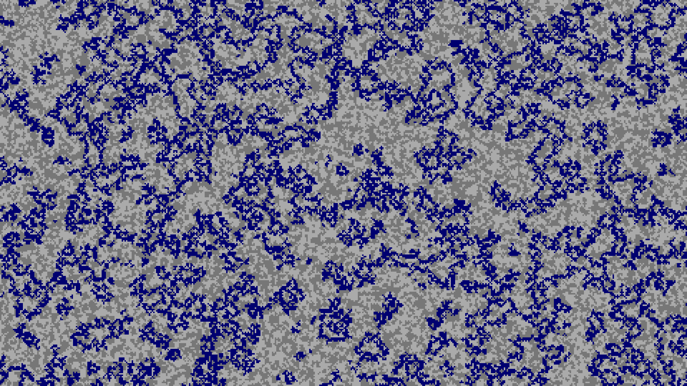
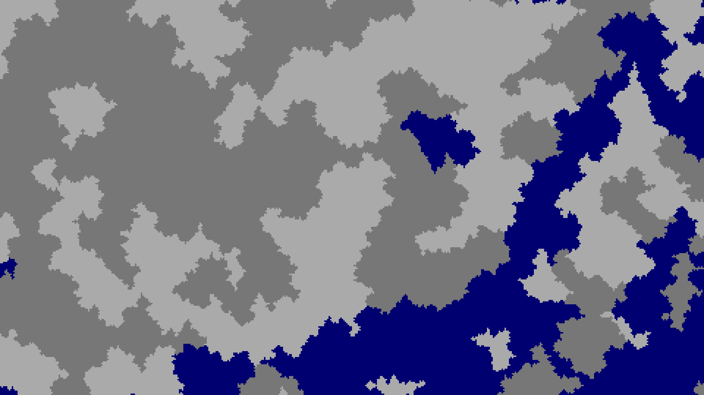

# 河流支线

## 水源

[主线链接](2.2-main-layer.md#加入深海)

浅海区元的保持不变为 0。非海洋区元生成一个位于区间`2 + [0, 299999) = [2, 300000]`中的随机噪声。但实际上，最终这个噪声只会进行奇偶性的判断，故我用两种不同的灰色区别了奇偶。

 

紧接着：两次放大化

   

## 河流距离

[主线链接](2.2-main-layer.md#向日葵平原)

河流支线先被放大化。放大的次数取决于官方名称叫**河流大小（RiverSize）**，而我更偏向于叫它**河流距离（RiverDistance）**。因为这个数值越大，河流之间的间距越大，而河流宽度并不会受此影响。默认为 4，**自定义（Customized）** 世界类型删除后便无法修改。接着迎接河流支线的是河流层和平滑层。

值得注意的是，生物群系大小的默认值和河流距离的默认值都是 4，所以放大化次数不会因为 biomeSize 的改变而改变，导致巨型生物群系世界类型下的河流和默认世界类型下的河流大小、位置几乎无差，使得默认世界中河流常常贴合生物群系边界的，巨型生物群系中则不总是如此。

## 河流

紧接着：河流层会对之前河流之前传来的数据做处理：

* 如果是海洋，保持海洋 0 不变。
* 如果大于等于 2，也就是河流，奇数取 3，偶数取 2。

如果自己处理后得到的数字和四周（車）处理后得到的数字全部相同，则该区元非河流（-1，图中用灰色标识），反之为河流（7）。

紧接着：[平滑](2.2-main-layer.md#平滑)

## 合并河流

[主线链接](2.2-main-layer.md#混合河流)

最后河流支线被合并

