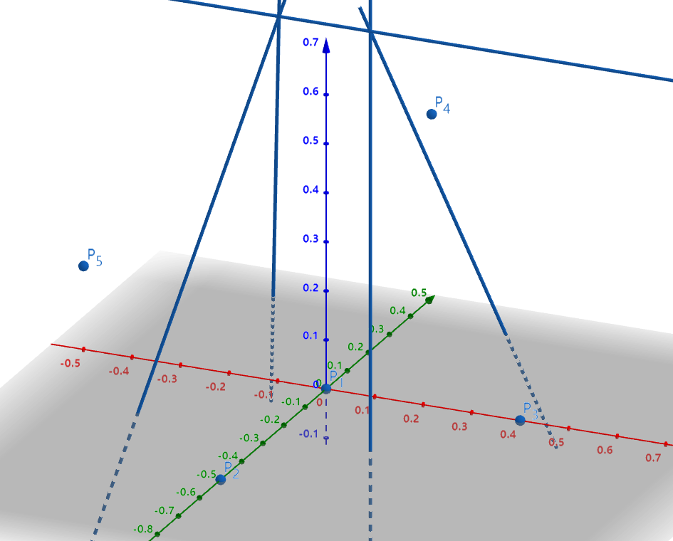

# The Nether

## 气候参数

**气候参数（ClimateParameter）** 包含下面这些分量。

| 参数   | 英文        | 最小值 | 最大值 |
| ------ | ----------- | ------ | ------ |
| 温度   | temperature | -2     | 2      |
| 湿度   | humidity    | -2     | 2      |
| 海拔   | altitude    | -2     | 2      |
| 诡异度 | weirdness   | -2     | 2      |
| 偏移   | offset      | 0      | 1      |

请勿与生物群系属性的温度、降水量、深度、规模混淆。它们之间没有任何直接或者间接的联系，只是名字相同或相近罢了。气候参数的最大值最小值仅用于限制自定义，原版数据均在此范围内。原版只有下界的五个生物群系有这些气候参数，如下表所示。

| 生物群系           | 温度 | 湿度 | 海拔 | 诡异度 | 偏移  |
| :----------------- | :--- | :--- | :--- | :----- | :---- |
| nether\_wastes     | 0.0  | 0.0  | 0.0  | 0.0    | 0.0   |
| soul\_sand\_valley | 0.0  | -0.5 | 0.0  | 0.0    | 0.0   |
| crimson\_forest    | 0.4  | 0.0  | 0.0  | 0.0    | 0.0   |
| warped\_forest     | 0.0  | 0.5  | 0.0  | 0.0    | 0.375 |
| basalt\_deltas     | -0.5 | 0.0  | 0.0  | 0.0    | 0.17  |

_在一些快照里面主世界的生物群系部分也有参数，可能是 Mojang 也用主世界来测试这一套系统_

## 多重噪声

下界的生物群系采用**多重噪声**生物群系来源（**Multi Noise** Biome Source）生成。这种方法非常“复古”，因为早期版本的主世界就是这样生成的，同时也非常简单，两句话就可以说清楚：

- 多重噪声生物群系来源有五个独立的三维噪声生成器，对应五个气候参数。它们能生成下界任一个区元的气候参数。即

`(x: int, y: int, z: int) -> (t: double, h: double, a: double, w: double, o: double)`

（在 1.16.5 里会故意传入 y = 0，造成所有高度的生物群系都仿佛（as if）是 y = 0 上的生物群系）

- 哪个生物群系的气候参数与区元的气候参数最接近（欧氏距离），区元的生物群系就是谁。

但这是不是略有些抽象？下面来详细介绍一下。

### 距离与相似度

说起噪声，不由得让你回忆起 [1.4 节#花](../1-introduction/1.4-properties-of-biome.md#花) 和 [2.4 节 海洋](../2-the-overworld/2.4-ocean-layer.md)。如果只有一个噪声，这很好想象。我们只要划定好阈值，就能得到边缘平滑的，层次分明的生物群系。

那如果噪声变为多个呢？在多个噪声上分别划定阈值？你可以自己动手试一下，你应该不难发现：这个过程非常痛苦和机械，你需要标定的量成倍增长且标定的区域很不直观，参数直接互相关联，牵一发而动全身，灵活性很差。

因此我们采用了另一种方法，给每个生物群系赋予一个标准的气候参数，以此为基准点，选择与当地气候参数选择相似度最高生物群系。这里我们采用的衡量相似度的方法是：把一个参数看做是五维空间中的一个点，两个点之间的（欧式）距离越小，两个参数之间的相似度就越大。

例如由上表得 nether_wastes`(t: 0.0, h: 0.0, a: 0.0, w: 0.0, o: 0.0)` soul\_sand\_valley`(t: 0.0, h: -0.5, a: 0.0, w: 0.0, o: 0.0)`

则某区元的气候参数 `(t: 0.0, h: -0.2, a: 0.0, w: 0.2, o: 0.0)` 与它们的距离分别为

$$
d_{\text{nether\_wastes}}=\sqrt{(0.0-0.0)^2+(0.0+0.2)^2+(0.0-0.0)^2+(0.0-0.2)^2+(0.0-0.0)^2}=0.28\\
d_{\text{soul\_sand\_valley}}=\sqrt{(0.0-0.0)^2+(-0.5+0.2)^2+(0.0-0.0)^2+(0.0-0.2)^2+(0.0-0.0)^2}=0.36
$$

显然与 nether_wastes 距离更近，即更加相似。若该区元的生物群系只能在这两个中选取，那么一定是选前者。

由于原版中有两个参数恒为 0，我们可以讲剩下三个参数作为 x y z 坐标，在一个三维空间中画出这五个点。联系几何知识，不难想到，两个点中垂面上的任意一个点到两点的距离是相等的。以 P1（nether_wastes）为例，做出其与另外四个点之间的四个中垂面，然后绘制出交线，如图所示，可以大致看出在哪些范围内的参数会成为 nether_wastes。同样的工作对于另外四个生物群系来说也是类似的。更进一步的，也可以推广到五个参数的五维空间。

_P1-5依次是上表中的五个生物群系的参数，红绿蓝坐标轴分别是温度、湿度、偏移_

## 分布

下面无情地放出示例地图的下界的区元的生物群系分布和实时放大化之后 y = 0 和 y = 64 的分布。

### 粗糙

### 实时放大化

y = 0

y = 64
