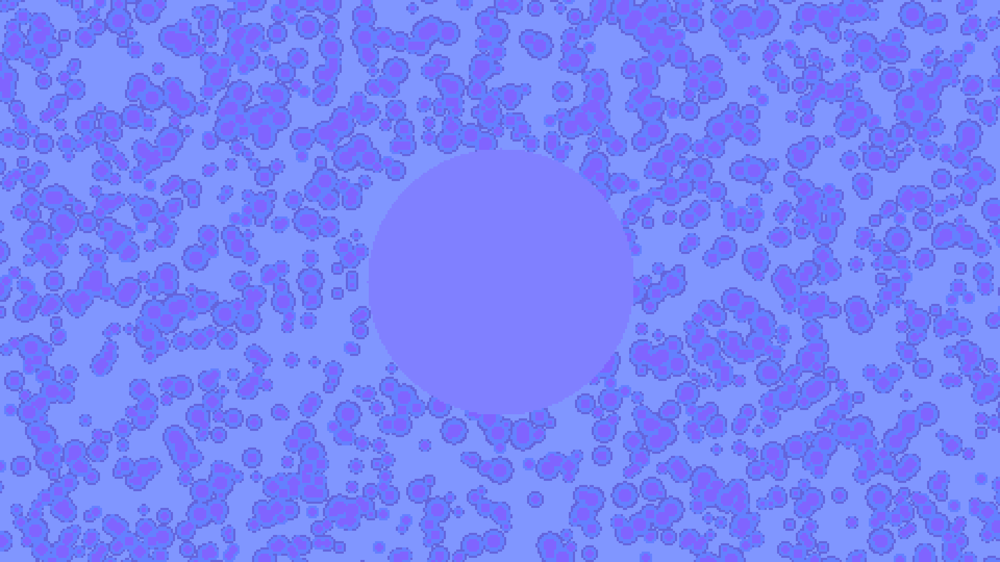

# The End

## 末地

末地是玩家游戏结束的地方（_而本教程也已经接近尾声_），为了适应独特的需求，**末地**生物群系来源（**The End** Biome Source）也是独具一格。

### 主岛

末地最经典的便是主岛。原版对此的处理是：末地中心（0, 0）周围半径 64 的区元（即半径 256 格方块）的圆形区域的生物群系均为经典的末地生物群系（the_end）。

### 外岛

外岛则有一个高度噪声，用以决定生物群系，从低到高，分别是 end_barrens、small_end_islands、end_midlands、end_highlands。

## 分布

下面无情地放出示例地图的末地的区元的生物群系分布和实时放大化之后 y = 0 和 y = 64 的分布。

### 粗糙

### 实时放大化

y = 0

y = 64
