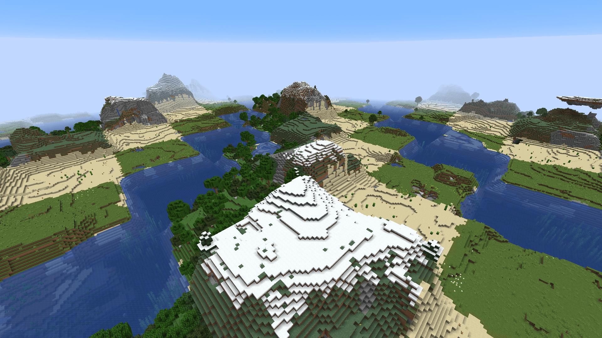

# Checkerboard

玩过国际象棋吗？即使没玩过，也会对它黑白相间的棋盘有印象。

**棋盘（Checkerboard）** 生物群系来源就是以此为灵感设计的。

这种生物群系来源有两个参数，size 和 biomes。size 是棋盘每个格子的边长，单位是区块。biomes 是候选的生物群系。

生物群系会按照 biomes 中的顺序，在世界中呈对角线条带生成。对于`x / size + z / size`相同的区块来说，生物群系是相同的。

这是一个隐藏的游戏特性，不能直接开启，需要修改存档的 nbt 或者利用模组才能实现。具体方法可以参考 wiki。

_你知道吗：本文的 logo就是取自于这张图，你能找到在哪里吗_

