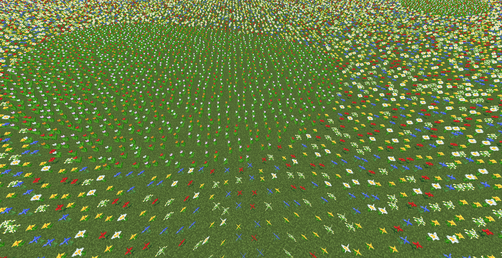

# TODO

TODO：单独介绍？

| 英文                   | 翻译     | 例子 |
| ---------------------- | -------- | ---- |
| RAW_GENERATION         | 原生生成 |      |
| LAKES                  | 湖       |      |
| LOCAL_MODIFICATIONS    | 本地修饰 |      |
| UNDERGROUND_STRUCTURES | 地下结构 |      |
| SURFACE_STRUCTURES     | 地面结构 |      |
| STRONGHOLDS            | 要塞     |      |
| UNDERGROUND_ORES       | 地下矿石 |      |
| UNDERGROUND_DECORATION | 地下装饰 |      |
| VEGETAL_DECORATION     | 植物装饰 |      |
| TOP_LAYER_MODIFICATION | 顶层修饰 |      |

## 出生点

生物群系其中一个属性有关出生点的选择

## 花

> （双手托起头）我是一朵花
>
> ——Yaossg 早年迷惑行为

生物群系其中一个属性是**花（Flower）**，主要分为两种分布——平原花和森林花

### 平原花

### 森林花

### 生物群系花朵表

TODO: verify

- _GB_表示不仅会自然生成，还能用骨粉催熟草方块获得
- _-_表示不会自然生成、也不能用骨粉催熟草方块获得
- _G_表示只会自然生成、不能用骨粉催熟草方块获得
- _B_表示不会自然生成、只能用骨粉催熟草方块获得

|    花    | 平原 | 向日葵平原 | 森林 桦木森林 黑森林 | 繁花森林 | 沼泽 | 恶地 蘑菇岛 | 其他 |
| :------: | :--: | :--------: | :------------------: | :------: | :--: | :---------: | :--: |
|  蒲公英  |  GB  |     GB     |          GB          |    GB    |  -   |      B      |  GB  |
|  虞美人  |  GB  |     GB     |          GB          |    GB    |  -   |      B      |  GB  |
|   兰花   |  -   |     -      |          -           |    -     |  GB  |      -      |  -   |
|  绒球葱  |  -   |     -      |          -           |    GB    |  -   |      -      |  -   |
|  茜草花  |  GB  |     GB     |          -           |    GB    |  -   |      -      |  -   |
|  郁金香  |  GB  |     GB     |          -           |    GB    |  -   |      -      |  -   |
|   滨菊   |  GB  |     GB     |          -           |    GB    |  -   |      -      |  -   |
|  矢车菊  |  GB  |     GB     |          -           |    GB    |  -   |      -      |  -   |
|   铃兰   |  -   |     -      |          G           |    GB    |  -   |      -      |  -   |
| 凋零玫瑰 |  -   |     -      |          -           |    -     |  -   |      -      |  -   |
|  向日葵  |  -   |     G      |          -           |    -     |  -   |      -      |  -   |
|   丁香   |  -   |     -      |          G           |    G     |  -   |      -      |  -   |
|  玫瑰丛  |  -   |     -      |          G           |    G     |  -   |      -      |  -   |
|   牡丹   |  -   |     -      |          G           |    G     |  -   |      -      |  -   |