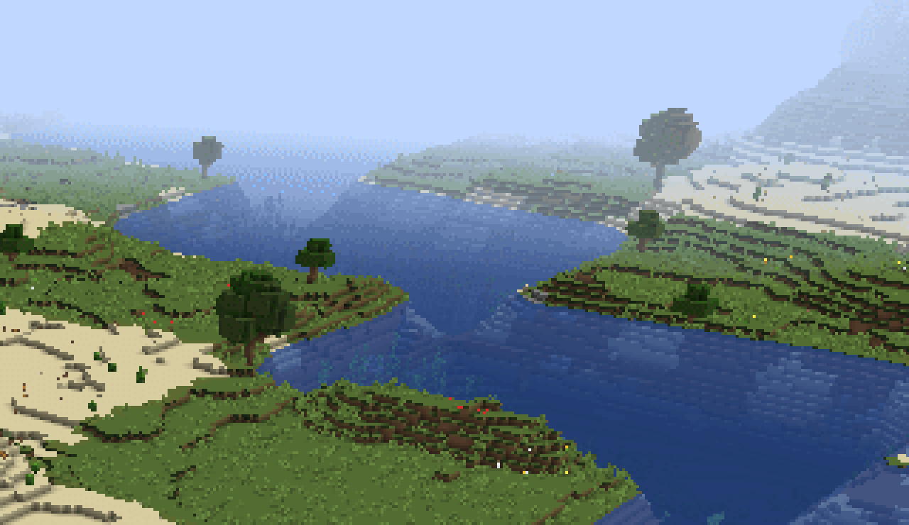

# 绪言

> 公无渡河，公竟渡河！堕河而死，其奈公何！
>
> ——《公无渡河》

## 前作

写前作我我完全是一时兴起——我当时毫无这方面的经验。我一直以来对世界生成有着敬畏之心，因为世界生成总是给人一种宏大、复杂、难以研究的感觉。我试过寻找一些世界生成的文章，Switefaster 给我推荐了土球的那一篇知乎回答。

探索没有终结，之后我也写过一些世界生成的模组，是在我那个练手的模组里。当时我的目标是“写遍所有的 ForgeRegistries”，其中有一个便是 Biome，顺藤摸瓜，我也看到了许多关于世界生成的事实。

1.13 原本是技术更新，代码大重写。在此之前我也开发过 1.12 Forge 的模组，对于 1.13 的代码可以说是耳目一新。这样的代码是 Mojang 写出来的？对我来说在以前想都不敢想。1.13 Forge 刚出的时候，正好是寒假，我马不停蹄开始了创作，那几天几乎是不分昼夜，终于在令我自己都难以相信的短时间内完成了文章。我硬着头皮发布了，不假思索。

为什么是「浅析」呢，因为我几乎是囫囵吞枣地把每个环节都过了一遍，造成差点把我噎死——我的理解不尽完善，文章漏洞百出，在这里再次感谢提出指正意见的读者。也有反馈说感觉内容不够详细，我想大概也是事实，但这也是不可避免的。海螺向我抛出了橄榄枝，我们互相在自己的帖子里加了对方帖子的链接。我当时还未意识到，海螺实际上也是国内在这条路上行走的、为数不多的先驱者。海螺曾向我们生动地描述过世界生成所用的那个数组，而那个数组从未走远。它的的确确在黑暗之中照出一条路，一条前人未曾走过、未曾设想的路。

后来我又进行了再版，是根据新版和新版教程进行的修订。最重要的删改可能是删去了生物群系有关的内容，这也意味着有关这一部分内容的中心全部转向这个教程。无论如何，旧的教程应该走入历史的垃圾桶了。

## 续作

> So you can put that in your **almanac**
>
> ——Phineas and Ferb《**We're Back**》

我回来了；没料到，旷日持久。

-----

> 一切都要从一只蝙蝠说起
>
> ——网络

在家的我又重新研究起了世界生成。

这次本来没想写这篇文章的——我最初的想法并不复杂，就是看看：原版如何生成生物群系？在这之前，其实已经有了不少模拟世界生成的网站、软件，或无扩展性可言，或依赖于 minecraft.jar。于是我萌生了做一个独立的生物群系生成模拟 api。把原版生物群系生成逻辑剥离出来，我相当于就研究了这整个过程，既然都研究了，索性就记录了下来。

我在写这篇文章的过程中，正经历着 1.16 下界更新，下界不再单调，最后一个单生物群系的维度跟我们说再见了。好在 1.14 - 1.16 的主世界生成代码都是一样的，我的前期努力没有白费；可是不断变化的代码，不断变化的名字，总是让我应接不暇，这让我走了不少弯路，放慢了教程的进度。在不断探索的过程之中，我更进一步的加入了许多相关的内容，也许最初文章的目标仅仅只是主世界的生物群系，但一不做二不休，既然来都来了，那我就干脆莽到底！

这次的创作还包含了前所未有的大胆尝试，想要带给大家的不再仅仅是干巴巴的文字：因为可视化是展示世界之美的重要一环。前作可是一幅图都没有；这次不仅又图，我还准备了视频以供欣赏。

-----

> 「长期更新」和「长期不更新」其实是一个意思，「长期」这个词本身就有了这个含义。
>
> ——Yaossg

香肠高三了。

-----

> 我如果说我的教程比作日本，那么 1.16.2 就是小男孩和胖子
>
> ——Yaossg 看了 1.16.2 代码后绝望地说

> 我没觉得更新不好，我只是发觉我之前大量的工作都变得毫无意义了，而感到惆怅
>
> ——Yaossg 在观看 Minecon Earth 2020 之后感叹

期待已久的 1.16.2 横空出世，可到头来却给我的教程带来了毁灭性的打击。1.16、1.16.2、1.17 可以说是对我“三连击”

类比英国脱欧，1.17 更新对我的打击便是：新教程发不出来了！我做了一年的工作，被事实打败了！1.17 是一个宏伟的更新，但是毫无疑问是在为我的教程敲响丧钟。

---

> 祸兮福所倚，福兮祸所伏
>
> ——《老子》

我没有想到的是，Mojang 1.17（现在叫 1.18）的跳票给了我一丝喘息的机会。某种意义上，我得救了。

让我感慨的是，当年 1.13 由技术更新和海洋更新合并而来，而我在这之后创作的我的第一篇教程；

如今 1.17 被拆分为两个部分，让我，和大多数模组作者得以在 1.16 上驻足观望。
